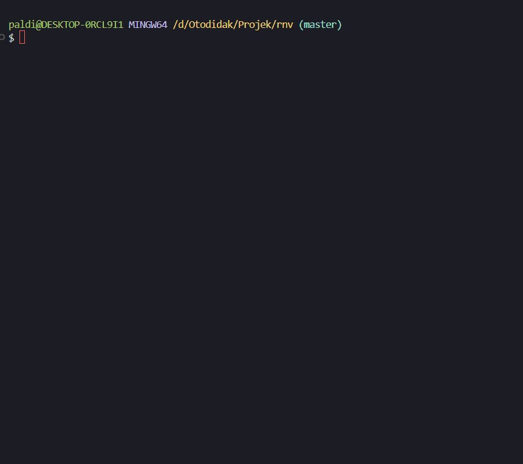
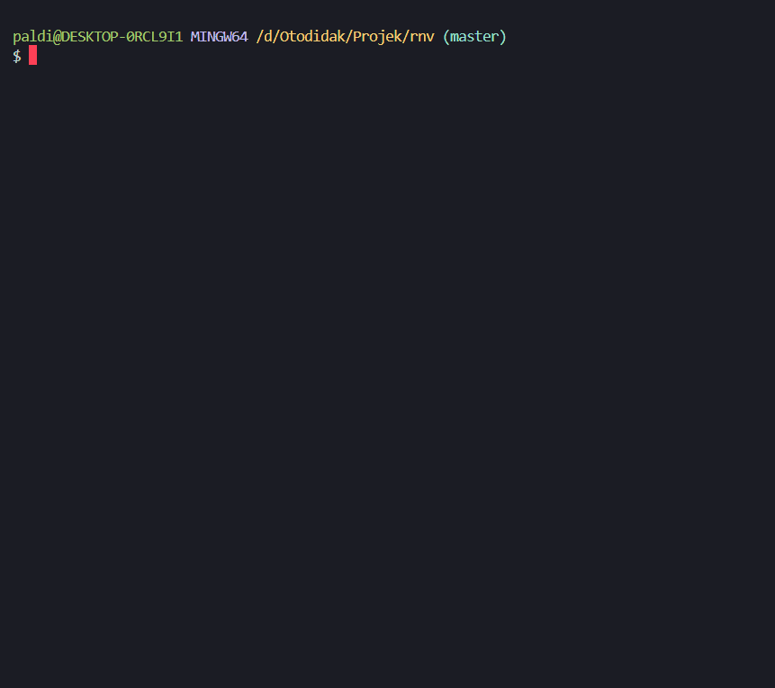

# rnv-cleaner


Sebuah tool CLI interaktif untuk membersihkan folder "sampah" proyek (`node_modules`, `vendor`, `.git`) dengan mudah dan cepat.

---

> Success
> 

> Canceled
> 

> No Detect
> 

---

## 👋 Tentang Proyek

Sebagai developer, kita sering kali punya banyak folder proyek lama di komputer. Setiap proyek, terutama proyek web, bisa memiliki folder `node_modules` yang ukurannya mencapai ratusan megabyte, bahkan gigabyte. Belum lagi folder `vendor` dari proyek PHP atau `.git` dari repositori lokal.

`rnv-cleaner` (remove node/vendor) hadir untuk menyelesaikan masalah ini. Tool ini akan memindai drive yang kamu pilih, menemukan semua folder boros tempat tersebut, dan memungkinkanmu untuk menghapusnya secara interaktif dan aman.

## ✨ Fitur Utama

- ✅ **Interaktif**: Menu yang mudah digunakan dengan navigasi panah.
- ✅ **Cerdas**: Otomatis memfilter hasil agar tidak menghapus folder `node_modules` yang ada di dalam `node_modules` lain yang juga akan dihapus.
- ✅ **Cross-Platform**: Berjalan di Windows, macOS, dan Linux.
- ✅ **Visual**: Dilengkapi _spinner_ saat mencari dan _progress bar_ saat memfilter & menghapus.
- ✅ **Fleksibel**: Bisa memilih target folder spesifik (`node_modules`, `vendor`, `.git`, atau kombinasi).
- ✅ **Opsi Manual**: Punya opsi untuk memasukkan path drive/folder secara manual jika tidak terdeteksi otomatis.

## 🚀 Instalasi

Pastikan kamu sudah menginstal **Node.js (versi 16 atau lebih baru)** di komputermu.

Kemudian, instal `rnv-cleaner` secara global melalui npm:

```bash
npm install -g rnv-cleaner
```
